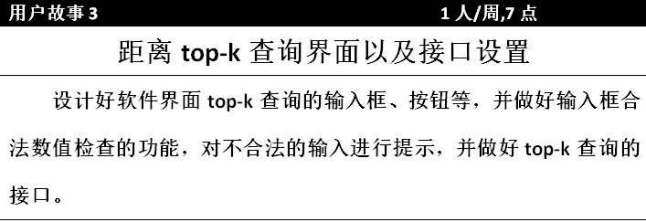
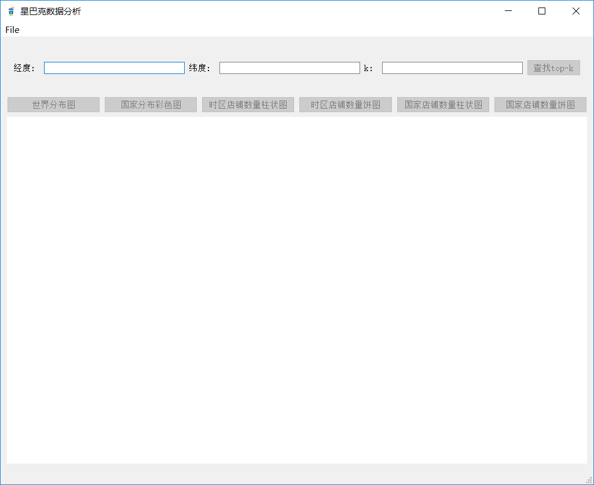
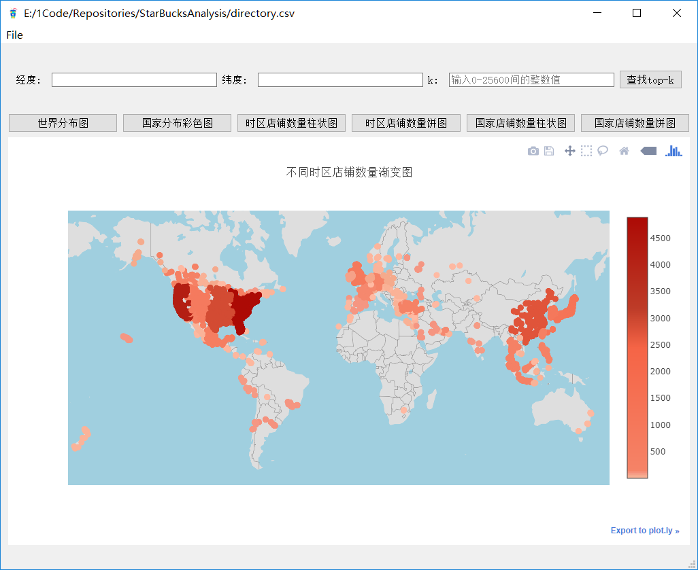
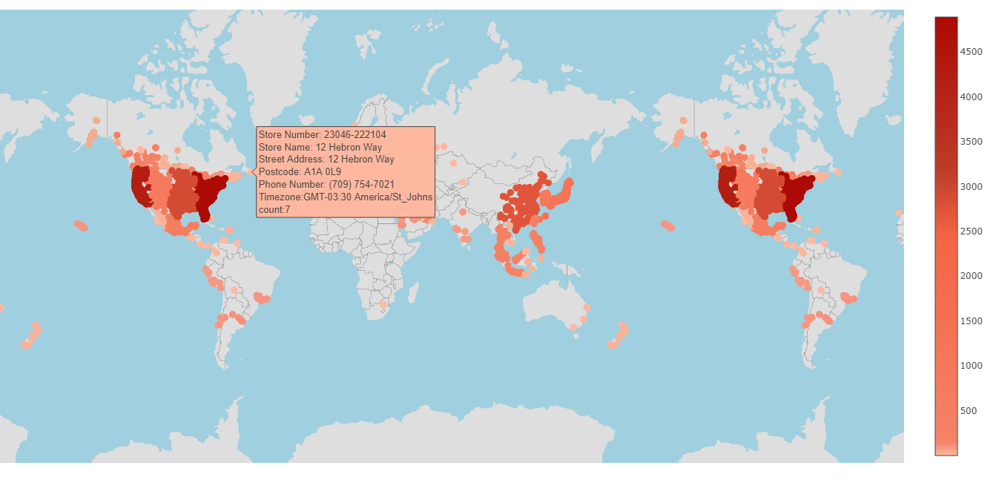
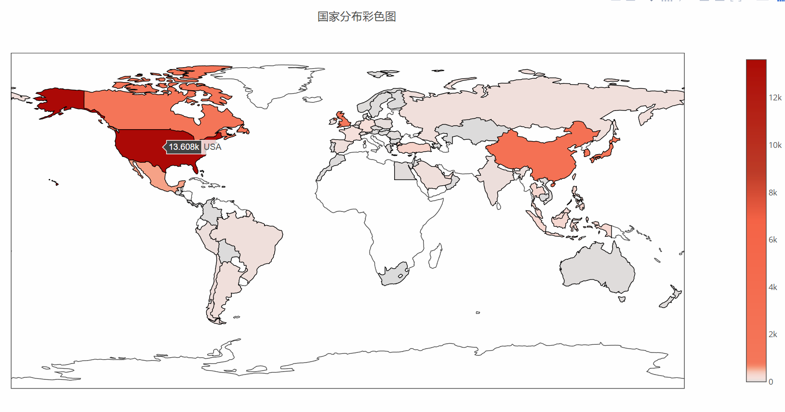
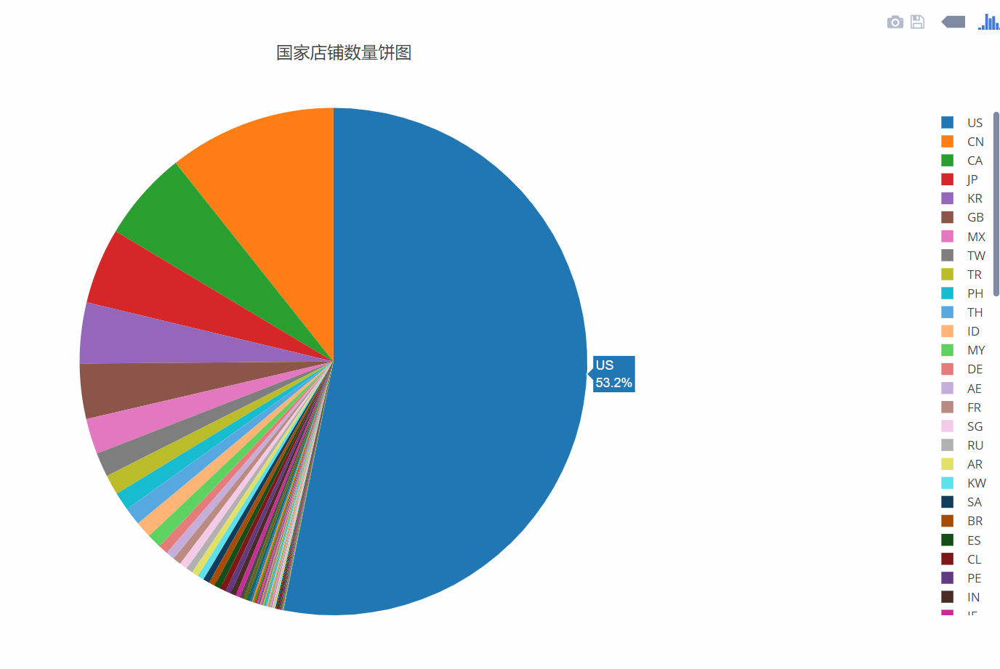
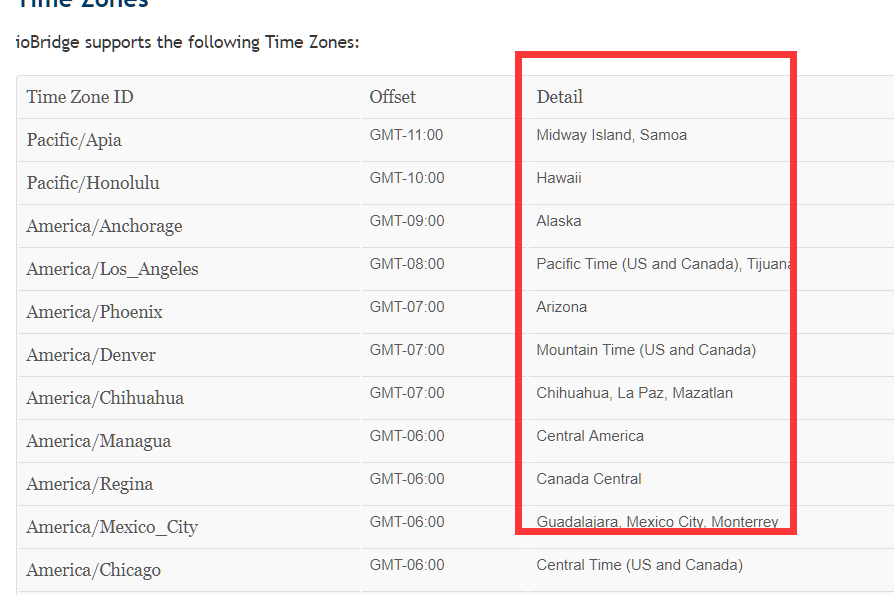
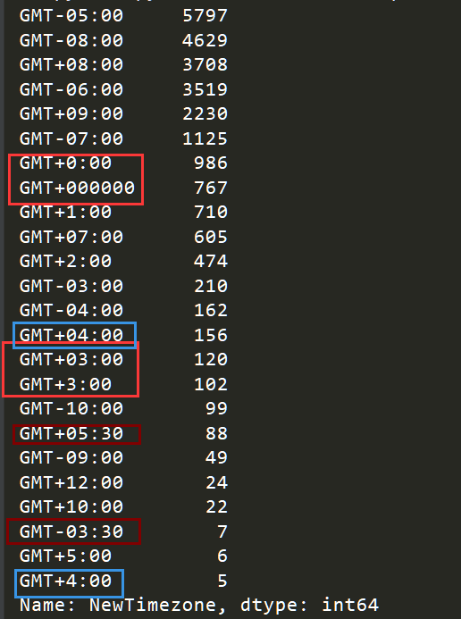
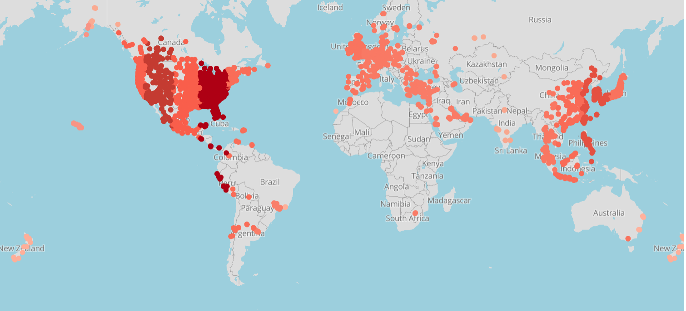

# StarBucksAnalysis
星巴克数据分析

## Iteration 3

星巴克数据分析工具 需求3

- 不同时区店铺数量渐变图：

    + 是第2轮迭代中“在将属于不同时区的店铺用不同颜色的点显示”的修改版

    + 用渐变色标识每个时区的店铺数量

    + 举例：店铺数量多的时区中的点用深红色、数量中等用正红色、数量少用浅红色

- 距离top-k查询：
    + 用户输入经纬度和一个参数k，展示距离其最近的k个星巴克

    + 具体要求：
        1. 直接根据经纬度计算距离即可，无需考虑建筑物、道路等因素的影响
        2. 如果用户输入的经纬度不合法，需要提示用户。
        3. 对用户的每一次输入，展示查询时延（即从查询发出，到结果返回所需要的时间）
        4. 用户输入经纬度，可视化展示随着k的增长查询时延的变化

### 本次迭代贡献度

- 2015052281 曾旭平 25%
- 2015052282 王壁鸿 25%
- 2015052283 梁伟杰 25%
- 2015052284 林汉忠 25%

### 小组的计划

#### 用户故事、排序、相关的估计

- 用户故事及估算
    + 统计每个时区的店铺数量 -> (**1人/天, 1点**)

    

    + 渐变色标识每个时区的店铺数量 -> (**3人/天, 3点**)

    

    + 距离top-k查询界面以及接口设置 -> (**1人/周, 7点**)

    

    + 设计经纬度计算距离算法 -> (**1人/天, 1点**)

    

    + 设计获取top-K的店铺信息算法 -> (**1人/周, 7点**)
    
    

    + 在地图展示top-K店铺，并显示时延 -> (**3人/天, 3点**)

    

    + 可视化展示随着k的增长查询时延的变化 -> (**2人/天，2点**)

    

- 排序
    + **优先级1**： 统计每个时区的店铺数量
    + **优先级2**： 渐变色标识每个时区的店铺数量
    + **优先级3**： 设计经纬度计算距离算法
    + **优先级4**： 距离top-k查询界面以及接口设置
    + **优先级5**： 设计获取top-K的店铺信息算法
    + **优先级6**： 在地图展示top-K店铺，并显示时延
    + **优先级7**： 可视化展示随着k的增长查询时延的变化

#### 小组的速度

- 第三次迭代所有用户故事均完成，开发速度为 1+3+7+1+7+3+2=**24点**
- 第二次迭代开发速度为 **25点**
- 小组的平均开发速度 **24.5点**

#### 软件介绍

- **软件主体窗口**



---

- **菜单栏打开文件**
    
    + 用于打开csv文件

    + 快捷键为Ctrl+O


---

- **星巴克时区店铺数量渐变色世界分布图**
    
    + 该图显示了星巴克店铺在全球**不同时区的数量**渐变分布

    + 时区中星巴克店铺**数量越多**，点的颜色**越深**；店铺数量**越少**，点的颜色**越浅**

    + 鼠标指向某一个星巴克店铺时，会显示该店铺的详细信息，包括编号、名称、地址、邮编、电话





---

- **星巴克店铺国家区域分布密度渐变图**
    
    + 该图显示了星巴克在不同国家分布的密度情况

    + 区域颜色越红，说明该区域星巴克店铺数量越多

    + 区域颜色为纯白色时，表明该区域无星巴克店铺



---

- **用户输入经纬度和一个参数k，展示距离其最近的k个星巴克**

    + 用户输入一个点的**经纬度**，以及参数**k**

    + 地图显示距离该点最近的**k个星巴克**


---

- **数据统计并可视化**

    + 在迭代1中，已经做了较为详尽的数据分析

    + 按本次需求，仅做了星巴克店铺时区分布和国家分布的柱状图和饼图

    + 由时区柱状图和饼图可知，时区GMT-05:00 America/New_York出现次数最多，且星巴克主要分布在美国时区中

    + 由国家分布柱状图和饼图可知， 星巴克店铺也是主要分布在美国




#### 开发过程总结

##### 关于时区问题的探讨
- 上网搜索了下GMT与UTC的区别
- 发现GMT其实与UTC是几乎是同一种概念，只是GMT是基于地球的自转和公转来计算时间，UTC是基于原子钟来计算时间的
- 而且我们数据中的GMT数据只是details数据，可以去掉




- 但是对数据进行清洗去除后缀后，发现如下情况



- 发现数据里面相同时区却是不同的字符串来表示，同时还存在着时区GMT+5:30等数据
- 所以我们放弃了去掉GMT数据后缀来划分时区，转向用经纬度换算时区的方式，绘制出如下图

- 与不去除后缀的时区渐变图相差不大， 但**保留后缀的时区渐变图**带有**国家信息**，分布更加**详细**，所以选择使用带有后缀的时区进行绘图

---

##### 对top-k算法的分析
***注: 可能因计算机环境不同，耗时不同***

- 快速选择算法 平均时间复杂度 O(n)

- 大顶堆求前k小值 时间复杂度 O(nlogk)

- pandas自带.nsmallest()函数

- 注： 还可使用geohash算法，本次迭代没有使用


- 由图可知
    + 一次遍历计算一个点与两万个点间距离的时间耗时大约是1s
    + 大顶堆的时间大约在100ms， 快速选择在40ms， pandas自带.nsmallest()函数时间在20ms左右
    + 因此我们topK的获取算法使用 pandas自带.nsmallest()

- 测试代码如下: 
```python
# -*- coding: utf-8 -*-
# __Author__: Sdite
# __Email__ : a122691411@gmail.com

import time
import heapq
import pandas as pd
from math import radians, atan, tan, sin, cos, acos

import plotly.offline as py
from plotly.graph_objs import *

ra = 6378.140  # 赤道半径 (km)
rb = 6356.755  # 极半径 (km)
flatten = (ra - rb) / ra  # 地球扁率
def calcDistance(lon_a, lat_a, lon_b, lat_b):
    rad_lat_A = radians(lat_a)
    rad_lng_A = radians(lon_a)
    rad_lat_B = radians(lat_b)
    rad_lng_B = radians(lon_b)
    pA = atan(rb / ra * tan(rad_lat_A))
    pB = atan(rb / ra * tan(rad_lat_B))
    xx = acos(sin(pA) * sin(pB) + cos(pA) * cos(pB) * cos(rad_lng_A - rad_lng_B))
    c1 = (sin(xx) - xx) * (sin(pA) + sin(pB)) ** 2 / cos(xx / 2) ** 2
    c2 = (sin(xx) + xx) * (sin(pA) - sin(pB)) ** 2 / sin(xx / 2) ** 2
    dr = flatten / 8 * (c1 - c2)
    distance = ra * (xx + dr)
    return distance

# 大顶堆求前k小
def topKHeap(A, k):
    res = []
    for elem in A:
        elem = -elem
        if len(res) < k:
            heapq.heappush(res, elem)
        else:
            topkSmall = res[0]
            if elem > topkSmall:
                heapq.heapreplace(res, elem)

    return list(map(lambda x: -x, res))

# 非递归实现
def qSelect(A, k):
    if len(A) < k:
        return A

    s = []
    res = []
    s.append(A)

    while s:
        B = s.pop()
        if not B:
            break
        pivot = B[0]
        left = [x for x in B[1:] if x < pivot] + [pivot]
        lLen = len(left)
        if lLen == k:
            res += left
        elif lLen > k:
            s.append(left)
        else:
            res += left
            k -= lLen
            right = [x for x in B[1:] if x >= pivot]
            s.append(right)

    return res

if __name__ == '__main__':
    csv_file = pd.read_csv("directory.csv")

    start = time.clock()
    distance = csv_file.apply(
        lambda x:calcDistance(0, 0, x.Longitude, x.Latitude),
                              axis=1)
    end = time.clock()

    print('遍历计算点间距离时间: %fs' % (end - start))

    useTime = dict()
    useTime['heap'] = []
    useTime['qSelect'] = []
    useTime['pandas'] = []

    for k in range(1, 25601):
        start = time.clock()
        topKHeap(distance, k)
        end = time.clock()
        h = end - start
        useTime['heap'].append(h)


        start = time.clock()
        qSelect(list(distance), k)
        end = time.clock()
        q = end - start
        useTime['qSelect'].append(q)


        start = time.clock()
        distance.nsmallest(k)
        end = time.clock()
        n = end - start
        useTime['pandas'].append(n)

        print("k: %d 大顶堆: %.15fs  快速选择: %.15fs  pandas: %.15fs" % (k, h, q, n))

    trace1 = Bar(
        x=useTime['heap'],
        y=range(1, 25601),
        name='大顶堆'
    )
    trace2 = Bar(
        x=useTime['qSelect'],
        y=range(1, 25601),
        name='快速选择'
    )
    trace3 = Bar(
        x=useTime['pandas'],
        y=range(1, 25601),
        name='pandas'
    )
    data = [trace1, trace2, trace3]
    layout = Layout(
        barmode='group'
    )
    fig = Figure(data=data, layout=layout)
    py.plot(fig, filename='时间比较')

```


